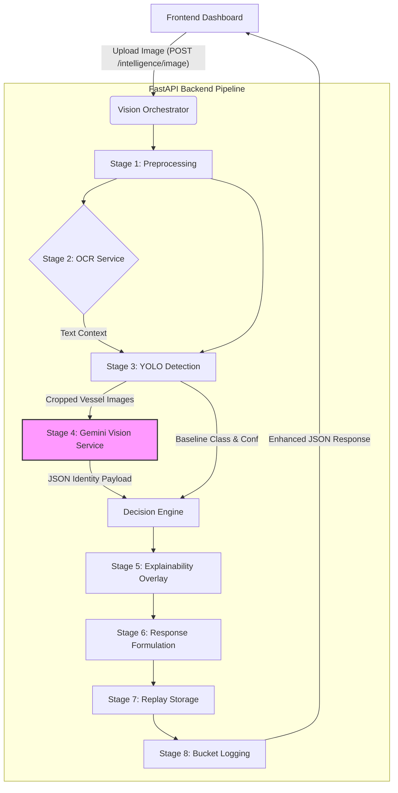

# SVACS v2.0 Architecture & Workflow (Gemini Vision API Integration)

This document provides a minute-by-minute breakdown of the SVACS (Samachar Vision Runtime) system's architecture and pipeline workflow, specifically focusing on the newly integrated **Gemini Vision API** using the `google-genai` SDK and the `gemini-3.6-flash` model.

---

## 1. High-Level Architecture Overview

SVACS operates on a decoupled client-server architecture:
- **Frontend (Client):** A React/Vite dashboard running on port `5173`. Users upload vessel imagery which is immediately posted to the backend. The frontend handles real-time rendering of complex response payloads (evidence chains, bounding boxes, identity resolution).
- **Backend (Server):** A FastAPI application running on port `8000`. It coordinates an intricate pipeline of computer vision, OCR, LLM-based generative AI, and decision fusion rules to classify, identify, and assess maritime vessels.

### Architecture Flow Diagram

---

## 2. The Enhanced Vision Pipeline Workflow

When a user uploads an image, the backend endpoint `POST /intelligence/image` is triggered. The request is immediately routed to the `VisionOrchestrator` (`process_bytes_enhanced()`), initiating the following 8-stage pipeline:

### Stage 1: Preprocessing
- **Decoding:** The raw byte payload is decoded into an OpenCV numpy array (`cv2.imdecode`).
- **Validation:** Ensures the image is not empty or corrupt.
- **Resizing/Standardization:** The image is optimized (`preprocess_for_inference()`) to ensure consistent dimensions and color spaces for the downstream YOLO and OCR models.

### Stage 2: OCR Extraction (EasyOCR)
- The preprocessed image is scanned by the local `ocr_service`.
- **Purpose:** Extracts any visible text from the hull, signage, or superstructure (e.g., pennant numbers, names like "Naval Dockyard").
- **Resilience:** This stage is wrapped in a generic `try/except`. If OCR fails, the pipeline degrades gracefully (non-fatal error) and continues without text context.

### Stage 3: Vessel Detection (YOLO / EfficientNet)
- The image is passed to `inference_service.detect()`.
- **Action:** A YOLO-based object detector scans the image for vessels, generating precise bounding boxes.
- **Classification Baseline:** An underlying EfficientNet model classifies the cropped bounding box into a baseline taxonomy (e.g., "Passenger Ferry", "Offshore Support Vessel") and assigns a confidence score.

### Stage 4: Generative Identity Resolution (Gemini Vision API)
This is the core of the v2.0 upgrade. For *each* bounding box detected by YOLO, the orchestrator triggers the `GeminiVisionService`:

1. **Cropping & Context:** The image is cropped to the vessel's bounding box with a 10% padding added to preserve surrounding visual context (e.g., wakes, docks).
2. **Context Fusion:** The OCR text detected in Stage 2 is concatenated into a single string (`ocr_context`) to provide the LLM with textual hints.
3. **API Request formulation:** The cropped image and prompt (with OCR context) are bundled using `google-genai` `types.Content`.
4. **Google GenAI Execution (`gemini-3.6-flash`):** 
    - Sent with strict generation configs (`temperature=0.1`, `max_output_tokens=1024`) to ensure deterministic JSON extraction.
    - **Self-Healing Retry Logic:** The service includes a custom exponential backoff loop. If Google's servers are overloaded (returning `503 UNAVAILABLE` or `429 Too Many Requests`), the system automatically waits 2 seconds, retries, and scales the delay up to 3 times before failing.
5. **Decision Engine Fusion:** 
    - The raw JSON from Gemini is parsed and sent to the `DecisionEngine`.
    - The engine mathematically fuses the Gemini results (identity, organization, visual evidence) with the baseline YOLO class and OCR text to determine the final `VesselDetectionItem` status (e.g., `IDENTIFIED`, `UNKNOWN`, or `VESSEL_DETECTED`).
6. **Fallback Mechanism:** If YOLO completely fails to find a bounding box in Stage 3, the orchestrator falls back to passing the *entire, uncropped image* to Gemini as a last-resort attempt to find a vessel.

### Stage 5: Explainability Overlay
- The pipeline utilizes `draw_enhanced_evidence()` to visually demonstrate how it arrived at its conclusion.
- It draws bounding boxes around detected vessels and overlays key text (e.g., "Identified: Ferry (CIVILIAN)").
- The final explained image is encoded back into base64 to be rendered in the frontend dashboard.

### Stage 6: Response Formulation
- The orchestrator parses the `enhanced_detections` array.
- It prioritizes the "best detection" using a status hierarchy: `IDENTIFIED` > `UNKNOWN` > `VESSEL_DETECTED` > `LOW_CONFIDENCE`.
- Formats a human-readable explanation list (e.g., "Identified as... Visual evidence: Double-deck small local passenger ferry boats").

### Stage 7: Replay Preservation
- A unique `trace_id` (UUID) is generated at the start of the pipeline.
- The raw image and the final JSON response payload are saved asynchronously to the local replay service. This creates an exact audit trail of the model's decision for future debugging or retraining.

### Stage 8: Bucket Logging (Data Layer)
- Final metadata (Detections and OCR results) are piped to the `write_vision_artifact` bucket client.
- This feeds the larger SVACS ecosystem, allowing for temporal aggregation and threat assessment across multiple independent images over time.

---

## 3. Technology Stack & Key Versions
- **Core Orchestrator Engine:** FastAPI / Python 3.13
- **GenAI Client SDK:** `google-genai` (v2+)
- **GenAI Model:** `gemini-3.6-flash` (Using API keys formatted with the `AQ.` prefix)
- **Local Vision ML:** YOLO (Detection), EfficientNet (Classification), EasyOCR (Text extraction)
- **Image Processing:** OpenCV (`cv2`) and NumPy

## 4. Resilience & Error Handling
Every stage in the SVACS pipeline is completely decoupled:
- If **Gemini** goes down (and exhausts retries), the system degrades to outputting the basic EfficientNet classification.
- If **OCR** fails, Gemini evaluates the image strictly visually.
- If **YOLO** fails, Gemini evaluates the full uncropped scene.
- If **Explainability** crashes, the system still returns the JSON payload so the UI can render textual data.
